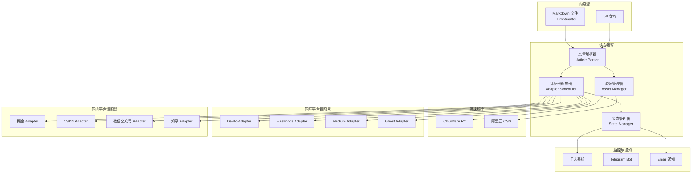
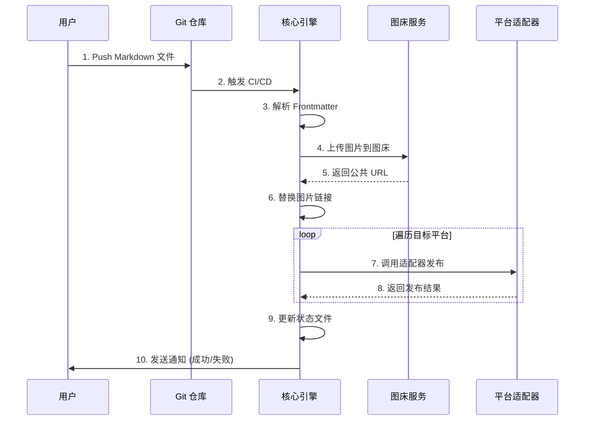

# OmniPublish 全平台发布系统 - 技术架构文档

> **版本**: v1.0  
> **更新日期**: 2026-01-01  
> **项目代号**: OmniPublish  
> **核心理念**: Write Once, Publish Everywhere

---

## 📋 目录

1. [系统概述](#系统概述)
2. [核心设计原则](#核心设计原则)
3. [技术栈选型](#技术栈选型)
4. [系统架构](#系统架构)
5. [核心模块设计](#核心模块设计)
6. [平台适配器架构](#平台适配器架构)
7. [数据流设计](#数据流设计)
8. [安全与风控](#安全与风控)
9. [扩展性设计](#扩展性设计)

---

## 系统概述

### 业务目标

OmniPublish 是一个**内容分发自动化平台**,旨在解决技术创作者在多平台发布内容时的痛点:

- ✅ **一次编写,多处发布**: 统一 Markdown 源,自动适配各平台格式
- ✅ **图片资源统一管理**: 自动上传图床,解决外链图片失效问题
- ✅ **SEO 优化**: 自动注入 canonical URL,避免重复内容惩罚
- ✅ **元数据标准化**: 统一管理标题、标签、封面图等元信息
- ✅ **发布状态追踪**: 记录每篇文章在各平台的发布状态和链接

### 核心价值

| 维度 | 传统方式 | OmniPublish |
|------|---------|-------------|
| **发布时间** | 30-60分钟/平台 | 5分钟全平台 |
| **图片处理** | 手动上传,重复劳动 | 自动转存图床 |
| **格式适配** | 手动调整各平台差异 | 自动转换 |
| **SEO管理** | 容易遗漏 canonical | 自动注入 |
| **错误处理** | 手动排查 | 自动重试+日志 |

---

## 核心设计原则

### 1. 模块化与解耦

```
┌─────────────────────────────────────────┐
│         统一接口层 (Adapter Interface)    │
├─────────────────────────────────────────┤
│  Dev.to  │ Hashnode │ Medium │ 掘金 │...│
└─────────────────────────────────────────┘
```

- 每个平台适配器独立开发,互不影响
- 核心引擎与适配器通过标准接口通信
- 新增平台只需实现 `IPlatformAdapter` 接口

### 2. 渐进式开发

**Phase 1: 国际平台 (API 优先)**
- ✅ 官方 API 稳定,易于维护
- ✅ 无风控风险,可快速验证架构
- 平台: Dev.to, Hashnode, Medium, Ghost

**Phase 2: 国内平台 (混合方案)**
- ⚠️ 需处理反爬虫机制
- ⚠️ Cookie 管理与刷新
- 平台: 掘金, CSDN, 微信公众号, 知乎

### 3. 防御性编程

> [!IMPORTANT]
> 遵循用户定义的"不报错/防错逻辑"原则

- **严禁静默失败**: 所有异常必须明确记录
- **完善的日志系统**: 分级日志 (DEBUG/INFO/WARN/ERROR)
- **自动重试机制**: 网络请求失败自动重试 3 次
- **降级策略**: 单个平台失败不影响其他平台

---

## 技术栈选型

### 后端核心

| 技术 | 用途 | 选型理由 |
|------|------|---------|
| **Python 3.10+** | 主语言 | 丰富的生态,易于维护 |
| **FastAPI** | API 服务 (可选) | 高性能,自动文档生成 |
| **Playwright** | 浏览器自动化 | 支持多浏览器,稳定性好 |
| **httpx** | HTTP 客户端 | 异步支持,性能优秀 |

### 内容处理

| 技术 | 用途 |
|------|------|
| **python-frontmatter** | YAML 元数据解析 |
| **markdown-it-py** | Markdown 解析与转换 |
| **Pillow** | 图片处理 (压缩/格式转换) |
| **BeautifulSoup4** | HTML 清洗与转换 |

### 图床与存储

| 方案 | 优势 | 劣势 |
|------|------|------|
| **阿里云 OSS** | 国内速度快,价格低 | 需备案域名 |
| **AWS S3** | 全球分布,稳定性高 | 国内访问慢 |
| **Cloudflare R2** | 免费额度大,无出站费用 | 新服务,生态待完善 |

**推荐**: Cloudflare R2 (开发阶段) + 阿里云 OSS (生产环境)

### CI/CD

```yaml
触发方式:
  - Git Push (自动触发)
  - GitHub Actions Workflow Dispatch (手动触发)
  - Cron 定时任务 (定期同步)
```

---

## 系统架构

### 整体架构图



### 核心流程



---

## 核心模块设计

### 1. 文章解析器 (Article Parser)

**职责**: 解析 Markdown 文件,提取元数据和内容

```python
# 文件: core/parser.py

from dataclasses import dataclass
from typing import List, Optional
import frontmatter

@dataclass
class ArticleMetadata:
    """文章元数据标准结构"""
    title: str
    tags: List[str]
    cover_image: Optional[str] = None
    canonical_url: Optional[str] = None
    published: bool = True
    series: Optional[str] = None
    description: Optional[str] = None
    
    # 平台特定配置
    platform_config: dict = None

class ArticleParser:
    """Markdown 文章解析器"""
    
    def parse(self, file_path: str) -> tuple[ArticleMetadata, str]:
        """
        解析 Markdown 文件
        
        Returns:
            (metadata, content): 元数据对象和 Markdown 内容
        """
        with open(file_path, 'r', encoding='utf-8') as f:
            post = frontmatter.load(f)
        
        metadata = ArticleMetadata(
            title=post.get('title'),
            tags=post.get('tags', []),
            cover_image=post.get('cover_image'),
            canonical_url=post.get('canonical_url'),
            published=post.get('published', True),
            series=post.get('series'),
            description=post.get('description'),
            platform_config=post.get('platform_config', {})
        )
        
        return metadata, post.content
```

**Frontmatter 示例**:

```yaml
---
title: "Python 异步编程完全指南"
tags: ["python", "async", "tutorial"]
cover_image: "./images/cover.png"
canonical_url: "https://myblog.com/python-async-guide"
published: true
series: "Python 进阶系列"
description: "深入理解 Python 的 asyncio 库"

platform_config:
  devto:
    organization_id: 12345
  medium:
    publish_status: "draft"
  juejin:
    category: "后端"
---

# 正文内容开始...
```

### 2. 资源管理器 (Asset Manager)

**职责**: 处理图片上传和链接替换

```python
# 文件: core/asset_manager.py

import re
import hashlib
from pathlib import Path
from typing import List, Tuple
import httpx
from PIL import Image

class AssetManager:
    """资源管理器 - 处理图片上传"""
    
    def __init__(self, oss_client):
        self.oss_client = oss_client
        self.image_pattern = re.compile(r'!\[([^\]]*)\]\(([^)]+)\)')
    
    def extract_images(self, markdown: str) -> List[str]:
        """提取 Markdown 中的所有图片路径"""
        return [match[1] for match in self.image_pattern.findall(markdown)]
    
    def upload_image(self, local_path: str) -> str:
        """
        上传图片到图床
        
        Returns:
            公共访问 URL
        """
        # 1. 图片优化 (压缩/格式转换)
        optimized_path = self._optimize_image(local_path)
        
        # 2. 生成唯一文件名 (基于内容哈希)
        file_hash = self._calculate_hash(optimized_path)
        ext = Path(local_path).suffix
        remote_name = f"articles/{file_hash}{ext}"
        
        # 3. 上传到 OSS
        public_url = self.oss_client.upload(optimized_path, remote_name)
        
        return public_url
    
    def replace_images(self, markdown: str, base_dir: Path) -> str:
        """替换 Markdown 中的本地图片链接为公共 URL"""
        
        def replace_func(match):
            alt_text = match.group(1)
            img_path = match.group(2)
            
            # 跳过已经是 HTTP 链接的图片
            if img_path.startswith(('http://', 'https://')):
                return match.group(0)
            
            # 上传本地图片
            local_path = (base_dir / img_path).resolve()
            public_url = self.upload_image(str(local_path))
            
            return f''
        
        return self.image_pattern.sub(replace_func, markdown)
    
    def _optimize_image(self, path: str) -> str:
        """图片优化: 压缩质量,限制尺寸"""
        img = Image.open(path)
        
        # 限制最大宽度为 1920px
        max_width = 1920
        if img.width > max_width:
            ratio = max_width / img.width
            new_size = (max_width, int(img.height * ratio))
            img = img.resize(new_size, Image.Resampling.LANCZOS)
        
        # 保存为优化后的文件
        optimized_path = f"{path}.optimized{Path(path).suffix}"
        img.save(optimized_path, quality=85, optimize=True)
        
        return optimized_path
    
    def _calculate_hash(self, path: str) -> str:
        """计算文件 MD5 哈希"""
        with open(path, 'rb') as f:
            return hashlib.md5(f.read()).hexdigest()
```

### 3. 适配器接口 (Platform Adapter Interface)

**职责**: 定义统一的平台适配器接口

```python
# 文件: core/adapter_interface.py

from abc import ABC, abstractmethod
from dataclasses import dataclass
from typing import Optional

@dataclass
class PublishResult:
    """发布结果"""
    success: bool
    platform: str
    article_url: Optional[str] = None
    error_message: Optional[str] = None
    raw_response: dict = None

class IPlatformAdapter(ABC):
    """平台适配器接口"""
    
    @property
    @abstractmethod
    def platform_name(self) -> str:
        """平台名称"""
        pass
    
    @abstractmethod
    def validate_config(self) -> bool:
        """验证配置 (API Key, Token 等)"""
        pass
    
    @abstractmethod
    def publish(self, metadata: 'ArticleMetadata', content: str) -> PublishResult:
        """
        发布文章
        
        Args:
            metadata: 文章元数据
            content: Markdown 内容 (图片链接已替换为公共 URL)
        
        Returns:
            PublishResult: 发布结果
        """
        pass
    
    @abstractmethod
    def update(self, article_id: str, metadata: 'ArticleMetadata', content: str) -> PublishResult:
        """更新已发布的文章"""
        pass
    
    @abstractmethod
    def delete(self, article_id: str) -> bool:
        """删除文章"""
        pass
```

### 4. 状态管理器 (State Manager)

**职责**: 记录文章在各平台的发布状态

```python
# 文件: core/state_manager.py

import json
from pathlib import Path
from datetime import datetime
from typing import Dict, List

class StateManager:
    """发布状态管理器"""
    
    def __init__(self, state_file: str = ".omnipublish/state.json"):
        self.state_file = Path(state_file)
        self.state_file.parent.mkdir(parents=True, exist_ok=True)
        self.state = self._load_state()
    
    def _load_state(self) -> dict:
        """加载状态文件"""
        if self.state_file.exists():
            with open(self.state_file, 'r', encoding='utf-8') as f:
                return json.load(f)
        return {}
    
    def save_state(self):
        """保存状态到文件"""
        with open(self.state_file, 'w', encoding='utf-8') as f:
            json.dump(self.state, f, indent=2, ensure_ascii=False)
    
    def record_publish(self, article_path: str, platform: str, result: 'PublishResult'):
        """记录发布结果"""
        if article_path not in self.state:
            self.state[article_path] = {}
        
        self.state[article_path][platform] = {
            'success': result.success,
            'url': result.article_url,
            'published_at': datetime.now().isoformat(),
            'error': result.error_message
        }
        
        self.save_state()
    
    def get_article_status(self, article_path: str) -> Dict[str, dict]:
        """获取文章在所有平台的发布状态"""
        return self.state.get(article_path, {})
    
    def is_published(self, article_path: str, platform: str) -> bool:
        """检查文章是否已在指定平台发布"""
        return platform in self.state.get(article_path, {})
```

---

## 平台适配器架构

### 适配器分类

```
适配器类型
├── API 适配器 (稳定,推荐)
│   ├── Dev.to
│   ├── Hashnode
│   ├── Medium
│   └── Ghost
│
├── 私有 API 适配器 (需逆向)
│   ├── 掘金
│   └── 微信公众号
│
└── 浏览器自动化适配器 (最后手段)
    ├── CSDN
    └── 知乎
```

### 示例: Dev.to 适配器

```python
# 文件: adapters/devto_adapter.py

import httpx
from core.adapter_interface import IPlatformAdapter, PublishResult
from core.parser import ArticleMetadata

class DevToAdapter(IPlatformAdapter):
    """Dev.to 平台适配器"""
    
    BASE_URL = "https://dev.to/api"
    
    def __init__(self, api_key: str):
        self.api_key = api_key
        self.headers = {
            "api-key": api_key,
            "Content-Type": "application/json"
        }
    
    @property
    def platform_name(self) -> str:
        return "Dev.to"
    
    def validate_config(self) -> bool:
        """验证 API Key 是否有效"""
        try:
            response = httpx.get(
                f"{self.BASE_URL}/users/me",
                headers=self.headers,
                timeout=10
            )
            return response.status_code == 200
        except Exception as e:
            print(f"❌ Dev.to API Key 验证失败: {e}")
            return False
    
    def publish(self, metadata: ArticleMetadata, content: str) -> PublishResult:
        """发布文章到 Dev.to"""
        
        payload = {
            "article": {
                "title": metadata.title,
                "body_markdown": content,
                "published": metadata.published,
                "tags": metadata.tags[:4],  # Dev.to 最多 4 个标签
                "series": metadata.series,
                "canonical_url": metadata.canonical_url,
                "description": metadata.description
            }
        }
        
        # 平台特定配置
        if metadata.platform_config and 'devto' in metadata.platform_config:
            payload['article'].update(metadata.platform_config['devto'])
        
        try:
            response = httpx.post(
                f"{self.BASE_URL}/articles",
                headers=self.headers,
                json=payload,
                timeout=30
            )
            
            if response.status_code == 201:
                data = response.json()
                return PublishResult(
                    success=True,
                    platform=self.platform_name,
                    article_url=data.get('url'),
                    raw_response=data
                )
            else:
                return PublishResult(
                    success=False,
                    platform=self.platform_name,
                    error_message=f"HTTP {response.status_code}: {response.text}"
                )
        
        except Exception as e:
            return PublishResult(
                success=False,
                platform=self.platform_name,
                error_message=str(e)
            )
    
    def update(self, article_id: str, metadata: ArticleMetadata, content: str) -> PublishResult:
        """更新文章"""
        # 实现类似 publish 的逻辑,使用 PUT 请求
        pass
    
    def delete(self, article_id: str) -> bool:
        """删除文章"""
        # 实现删除逻辑
        pass
```

---

## 数据流设计

### 配置文件结构

```yaml
# 文件: config.yaml

# 图床配置
image_storage:
  provider: "cloudflare_r2"  # 或 "aliyun_oss", "aws_s3"
  
  cloudflare_r2:
    account_id: "your_account_id"
    access_key_id: "your_access_key"
    secret_access_key: "your_secret"
    bucket_name: "omnipublish-assets"
    public_url: "https://assets.yourdomain.com"

# 平台配置
platforms:
  # 国际平台
  devto:
    enabled: true
    api_key: "${DEVTO_API_KEY}"  # 从环境变量读取
  
  hashnode:
    enabled: true
    access_token: "${HASHNODE_TOKEN}"
    publication_id: "your_pub_id"
  
  medium:
    enabled: false  # 暂时禁用
    integration_token: "${MEDIUM_TOKEN}"
  
  # 国内平台
  juejin:
    enabled: true
    cookie: "${JUEJIN_COOKIE}"
  
  wechat:
    enabled: true
    appid: "${WECHAT_APPID}"
    secret: "${WECHAT_SECRET}"

# 全局配置
global:
  canonical_base_url: "https://myblog.com"  # 主站地址
  retry_times: 3
  retry_delay: 5  # 秒
  random_delay_range: [2, 5]  # 国内平台随机延时范围
```

---

## 安全与风控

### 1. 凭证管理

> [!CAUTION]
> 严禁将 API Key、Token、Cookie 硬编码到代码中

**推荐方案**:

```python
# 使用环境变量
import os
from dotenv import load_dotenv

load_dotenv()

DEVTO_API_KEY = os.getenv('DEVTO_API_KEY')
```

**GitHub Actions 配置**:

```yaml
# .github/workflows/publish.yml
env:
  DEVTO_API_KEY: ${{ secrets.DEVTO_API_KEY }}
  HASHNODE_TOKEN: ${{ secrets.HASHNODE_TOKEN }}
```

### 2. 国内平台风控策略

> [!WARNING]
> 国内平台的反爬虫机制严格,必须模拟真实用户行为

**防封号措施**:

1. **随机延时**: 请求之间暂停 2-5 秒
2. **User-Agent 轮换**: 使用真实浏览器的 UA
3. **Cookie 定期刷新**: 避免 Cookie 过期
4. **请求频率限制**: 每小时不超过 10 篇文章
5. **异常检测**: 遇到验证码立即停止,发送通知

```python
import random
import time

def safe_request_with_delay(func):
    """装饰器: 添加随机延时"""
    def wrapper(*args, **kwargs):
        delay = random.uniform(2, 5)
        time.sleep(delay)
        return func(*args, **kwargs)
    return wrapper
```

### 3. 错误处理与重试

```python
import httpx
from tenacity import retry, stop_after_attempt, wait_exponential

@retry(
    stop=stop_after_attempt(3),
    wait=wait_exponential(multiplier=1, min=4, max=10)
)
def publish_with_retry(adapter, metadata, content):
    """带重试的发布函数"""
    result = adapter.publish(metadata, content)
    
    if not result.success:
        raise Exception(f"发布失败: {result.error_message}")
    
    return result
```

---

## 扩展性设计

### 1. 插件化架构

```python
# 文件: core/plugin_manager.py

class PluginManager:
    """插件管理器 - 动态加载适配器"""
    
    def __init__(self):
        self.adapters = {}
    
    def register_adapter(self, adapter_class):
        """注册适配器"""
        adapter = adapter_class()
        self.adapters[adapter.platform_name] = adapter
    
    def get_adapter(self, platform_name: str):
        """获取适配器实例"""
        return self.adapters.get(platform_name)
```

### 2. 内容转换器扩展

```python
# 支持未来扩展其他格式
class ContentConverter:
    """内容格式转换器"""
    
    @staticmethod
    def markdown_to_html(markdown: str) -> str:
        """Markdown 转 HTML"""
        pass
    
    @staticmethod
    def markdown_to_wechat_html(markdown: str) -> str:
        """Markdown 转微信富文本"""
        pass
    
    @staticmethod
    def markdown_to_notion(markdown: str) -> dict:
        """Markdown 转 Notion Blocks"""
        pass
```

---

## 总结

本技术架构文档定义了 OmniPublish 系统的核心设计:

✅ **模块化设计**: 核心引擎与适配器解耦  
✅ **渐进式开发**: 先国际平台,后国内平台  
✅ **防御性编程**: 完善的错误处理和日志  
✅ **安全优先**: 凭证管理与风控策略  
✅ **易于扩展**: 插件化架构,支持新平台接入

**下一步**: 查看 [实施计划文档](./02_实施计划.md) 了解具体开发步骤
