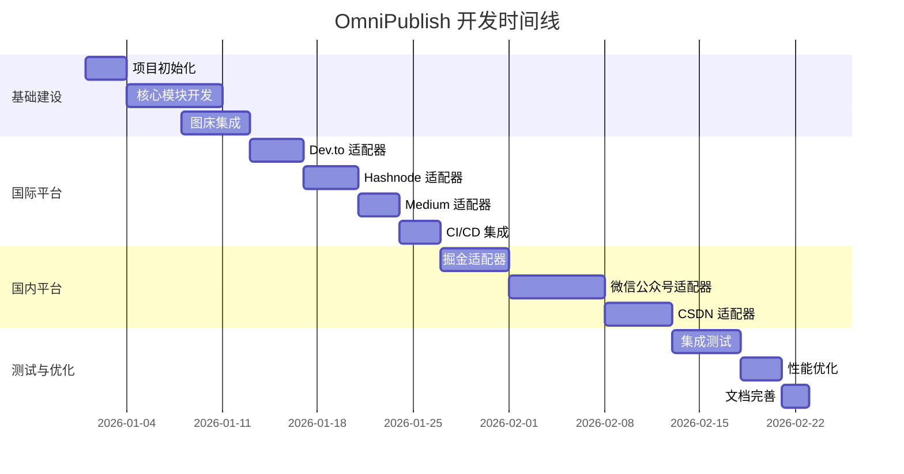

# OmniPublish 全平台发布系统 - 实施计划

> **版本**: v1.0  
> **更新日期**: 2026-01-01  
> **预计开发周期**: 6-8 周

---

## 📋 目录

1. [开发里程碑](#开发里程碑)
2. [Sprint 详细规划](#sprint-详细规划)
3. [技术选型确认](#技术选型确认)
4. [风险评估与应对](#风险评估与应对)
5. [验证计划](#验证计划)

---

## 开发里程碑



### 里程碑检查点

| 里程碑 | 完成标准 | 预计日期 |
|--------|---------|---------|
| **M1: 核心引擎完成** | 文章解析、图片上传、状态管理模块通过单元测试 | 2026-01-12 |
| **M2: 国际平台上线** | Dev.to + Hashnode 成功发布测试文章 | 2026-01-27 |
| **M3: 国内平台上线** | 掘金 + 微信公众号成功发布 | 2026-02-10 |
| **M4: 系统稳定运行** | 连续 7 天无故障自动发布 | 2026-02-23 |

---

## Sprint 详细规划

### Sprint 1: 基础建设 (Week 1-2)

#### 目标
搭建项目骨架,完成核心模块开发

#### 任务清单

**1.1 项目初始化**
```bash
# 创建项目结构
omnipublish/
├── core/                    # 核心模块
│   ├── __init__.py
│   ├── parser.py           # 文章解析器
│   ├── asset_manager.py    # 资源管理器
│   ├── adapter_interface.py # 适配器接口
│   └── state_manager.py    # 状态管理器
├── adapters/               # 平台适配器
│   ├── __init__.py
│   ├── devto_adapter.py
│   ├── hashnode_adapter.py
│   └── ...
├── utils/                  # 工具函数
│   ├── logger.py          # 日志系统
│   ├── retry.py           # 重试机制
│   └── validator.py       # 配置验证
├── tests/                 # 测试文件
├── config.yaml            # 配置文件
├── requirements.txt       # 依赖列表
└── main.py               # 主入口
```

**1.2 依赖安装**
```txt
# requirements.txt
python-frontmatter==1.0.0
httpx==0.25.0
pyyaml==6.0.1
python-dotenv==1.0.0
Pillow==10.1.0
tenacity==8.2.3
loguru==0.7.2
playwright==1.40.0
beautifulsoup4==4.12.2
markdown-it-py==3.0.0
```

**1.3 核心模块开发**

- [x] 实现 `ArticleParser` 类
  - 解析 Frontmatter
  - 提取元数据
  - 验证必填字段
  
- [x] 实现 `AssetManager` 类
  - 提取 Markdown 中的图片
  - 图片优化 (压缩/格式转换)
  - 上传到图床
  - 替换图片链接

- [x] 实现 `StateManager` 类
  - 加载/保存状态文件
  - 记录发布结果
  - 查询发布状态

- [x] 实现 `IPlatformAdapter` 接口
  - 定义标准方法
  - 编写接口文档

**1.4 图床集成**

选择 **Cloudflare R2** 作为主要图床:

```python
# utils/r2_client.py

import boto3
from botocore.config import Config

class CloudflareR2Client:
    """Cloudflare R2 客户端"""
    
    def __init__(self, account_id: str, access_key: str, secret_key: str, bucket: str):
        self.bucket = bucket
        
        # R2 兼容 S3 API
        self.s3 = boto3.client(
            's3',
            endpoint_url=f'https://{account_id}.r2.cloudflarestorage.com',
            aws_access_key_id=access_key,
            aws_secret_access_key=secret_key,
            config=Config(signature_version='s3v4')
        )
    
    def upload(self, local_path: str, remote_key: str) -> str:
        """上传文件到 R2"""
        with open(local_path, 'rb') as f:
            self.s3.upload_fileobj(f, self.bucket, remote_key)
        
        # 返回公共 URL
        return f"https://assets.yourdomain.com/{remote_key}"
```

**验收标准**:
- ✅ 所有核心模块通过单元测试
- ✅ 图床上传成功率 > 99%
- ✅ 代码覆盖率 > 80%

---

### Sprint 2: 国际平台适配 (Week 3-4)

#### 目标
完成 Dev.to、Hashnode、Medium 三个平台的适配器

#### 2.1 Dev.to 适配器

**API 文档**: https://developers.forem.com/api/v1

**实现要点**:
```python
# adapters/devto_adapter.py

class DevToAdapter(IPlatformAdapter):
    
    def publish(self, metadata, content):
        payload = {
            "article": {
                "title": metadata.title,
                "body_markdown": content,
                "published": metadata.published,
                "tags": metadata.tags[:4],  # 最多 4 个标签
                "canonical_url": metadata.canonical_url
            }
        }
        
        response = httpx.post(
            "https://dev.to/api/articles",
            headers={"api-key": self.api_key},
            json=payload
        )
        
        # 处理响应...
```

**测试用例**:
```python
# tests/test_devto_adapter.py

def test_publish_article():
    adapter = DevToAdapter(api_key=os.getenv('DEVTO_API_KEY'))
    
    metadata = ArticleMetadata(
        title="测试文章",
        tags=["test", "automation"]
    )
    
    content = "# 测试内容\n\n这是一篇测试文章。"
    
    result = adapter.publish(metadata, content)
    
    assert result.success == True
    assert result.article_url is not None
```

#### 2.2 Hashnode 适配器

**API 文档**: https://apidocs.hashnode.com/

**GraphQL 查询示例**:
```graphql
mutation PublishPost {
  publishPost(
    input: {
      title: "文章标题"
      contentMarkdown: "Markdown 内容"
      tags: [{_id: "tag_id"}]
      publicationId: "pub_id"
    }
  ) {
    post {
      _id
      slug
      url
    }
  }
}
```

#### 2.3 Medium 适配器

**注意事项**:
- Medium API 只能创建草稿或 Unlisted 文章
- 不支持更新已发布文章
- 建议设置为 `publishStatus: "draft"`

**实现策略**:
```python
def publish(self, metadata, content):
    # 1. 获取用户 ID
    user_id = self._get_user_id()
    
    # 2. 创建文章 (草稿状态)
    payload = {
        "title": metadata.title,
        "contentFormat": "markdown",
        "content": content,
        "tags": metadata.tags[:5],  # 最多 5 个标签
        "publishStatus": "draft",
        "canonicalUrl": metadata.canonical_url
    }
    
    # 3. 发布
    response = httpx.post(
        f"https://api.medium.com/v1/users/{user_id}/posts",
        headers={"Authorization": f"Bearer {self.token}"},
        json=payload
    )
```

**验收标准**:
- ✅ 三个平台适配器全部通过集成测试
- ✅ 成功发布真实测试文章
- ✅ 错误处理覆盖所有异常情况

---

### Sprint 3: CI/CD 集成 (Week 4)

#### 目标
实现 GitHub Actions 自动发布工作流

#### 3.1 工作流配置

```yaml
# .github/workflows/publish.yml

name: OmniPublish Auto Publish

on:
  push:
    branches: [main]
    paths:
      - 'articles/**/*.md'
  workflow_dispatch:  # 支持手动触发

jobs:
  publish:
    runs-on: ubuntu-latest
    
    steps:
      - name: Checkout 代码
        uses: actions/checkout@v4
      
      - name: 设置 Python 环境
        uses: actions/setup-python@v5
        with:
          python-version: '3.11'
      
      - name: 安装依赖
        run: |
          pip install -r requirements.txt
          playwright install chromium
      
      - name: 发布文章
        env:
          DEVTO_API_KEY: ${{ secrets.DEVTO_API_KEY }}
          HASHNODE_TOKEN: ${{ secrets.HASHNODE_TOKEN }}
          MEDIUM_TOKEN: ${{ secrets.MEDIUM_TOKEN }}
          R2_ACCESS_KEY: ${{ secrets.R2_ACCESS_KEY }}
          R2_SECRET_KEY: ${{ secrets.R2_SECRET_KEY }}
        run: |
          python main.py --mode auto
      
      - name: 上传发布报告
        uses: actions/upload-artifact@v4
        with:
          name: publish-report
          path: .omnipublish/report.json
      
      - name: 发送通知
        if: failure()
        uses: appleboy/telegram-action@master
        with:
          to: ${{ secrets.TELEGRAM_CHAT_ID }}
          token: ${{ secrets.TELEGRAM_BOT_TOKEN }}
          message: |
            ❌ 文章发布失败
            仓库: ${{ github.repository }}
            提交: ${{ github.sha }}
```

#### 3.2 主程序入口

```python
# main.py

import argparse
from pathlib import Path
from core.parser import ArticleParser
from core.asset_manager import AssetManager
from core.state_manager import StateManager
from adapters import DevToAdapter, HashnodeAdapter
from utils.logger import setup_logger
from utils.r2_client import CloudflareR2Client

logger = setup_logger()

def main():
    parser = argparse.ArgumentParser()
    parser.add_argument('--mode', choices=['auto', 'manual'], default='manual')
    parser.add_argument('--file', help='指定要发布的文章路径')
    args = parser.parse_args()
    
    # 初始化组件
    r2_client = CloudflareR2Client(...)
    asset_manager = AssetManager(r2_client)
    state_manager = StateManager()
    
    # 初始化适配器
    adapters = [
        DevToAdapter(api_key=os.getenv('DEVTO_API_KEY')),
        HashnodeAdapter(token=os.getenv('HASHNODE_TOKEN'))
    ]
    
    # 获取待发布文章
    if args.mode == 'auto':
        articles = find_new_articles(state_manager)
    else:
        articles = [args.file]
    
    # 发布流程
    for article_path in articles:
        logger.info(f"📝 处理文章: {article_path}")
        
        # 1. 解析文章
        article_parser = ArticleParser()
        metadata, content = article_parser.parse(article_path)
        
        # 2. 处理图片
        content = asset_manager.replace_images(content, Path(article_path).parent)
        
        # 3. 发布到各平台
        for adapter in adapters:
            if not adapter.validate_config():
                logger.warning(f"⚠️ {adapter.platform_name} 配置无效,跳过")
                continue
            
            logger.info(f"🚀 发布到 {adapter.platform_name}...")
            result = adapter.publish(metadata, content)
            
            # 4. 记录结果
            state_manager.record_publish(article_path, adapter.platform_name, result)
            
            if result.success:
                logger.success(f"✅ {adapter.platform_name}: {result.article_url}")
            else:
                logger.error(f"❌ {adapter.platform_name}: {result.error_message}")

if __name__ == '__main__':
    main()
```

---

### Sprint 4: 国内平台适配 (Week 5-7)

#### 目标
完成掘金、微信公众号、CSDN 适配器

#### 4.1 掘金适配器 (私有 API)

**逆向分析要点**:

1. **认证机制**:
   - Cookie 中的 `sessionid`
   - Header 中的 `x-secsdk-csrf-token` (从 Cookie 中提取)

2. **发布接口**:
```python
# adapters/juejin_adapter.py

class JuejinAdapter(IPlatformAdapter):
    
    BASE_URL = "https://api.juejin.cn/content_api/v1"
    
    def __init__(self, cookie: str):
        self.cookie = cookie
        self.csrf_token = self._extract_csrf_token(cookie)
    
    def _extract_csrf_token(self, cookie: str) -> str:
        """从 Cookie 中提取 CSRF Token"""
        # 解析逻辑...
        pass
    
    def publish(self, metadata, content):
        # 1. 创建草稿
        draft_id = self._create_draft(metadata, content)
        
        # 2. 发布草稿
        payload = {
            "draft_id": draft_id,
            "sync_to_org": False,
            "column_ids": []
        }
        
        response = httpx.post(
            f"{self.BASE_URL}/article/publish",
            headers={
                "Cookie": self.cookie,
                "x-secsdk-csrf-token": self.csrf_token
            },
            json=payload
        )
        
        # 处理响应...
```

**风控策略**:
```python
import random
import time

@safe_request_with_delay
def publish(self, metadata, content):
    # 随机延时 2-5 秒
    delay = random.uniform(2, 5)
    time.sleep(delay)
    
    # 发布逻辑...
```

#### 4.2 微信公众号适配器

**方案**: 使用官方草稿箱 API

**关键步骤**:

1. **Markdown 转微信 HTML**:
```python
from markdown_it import MarkdownIt
from bs4 import BeautifulSoup

def markdown_to_wechat_html(markdown: str) -> str:
    """转换 Markdown 为微信富文本"""
    
    # 1. Markdown 转 HTML
    md = MarkdownIt()
    html = md.render(markdown)
    
    # 2. 应用微信样式
    soup = BeautifulSoup(html, 'html.parser')
    
    # 代码块样式
    for code in soup.find_all('code'):
        code['style'] = 'background: #f6f6f6; padding: 2px 4px;'
    
    # 标题样式
    for h2 in soup.find_all('h2'):
        h2['style'] = 'font-size: 18px; font-weight: bold; margin: 20px 0;'
    
    return str(soup)
```

2. **上传图片到微信素材库**:
```python
def upload_image_to_wechat(self, image_url: str) -> str:
    """上传图片到微信素材库,返回 media_id"""
    
    # 1. 下载图片
    response = httpx.get(image_url)
    
    # 2. 上传到微信
    files = {'media': ('image.jpg', response.content, 'image/jpeg')}
    upload_response = httpx.post(
        f"https://api.weixin.qq.com/cgi-bin/material/add_material?access_token={self.access_token}",
        files=files
    )
    
    return upload_response.json()['media_id']
```

3. **创建草稿**:
```python
def publish(self, metadata, content):
    # 1. 转换为微信 HTML
    html_content = markdown_to_wechat_html(content)
    
    # 2. 上传封面图
    thumb_media_id = self.upload_image_to_wechat(metadata.cover_image)
    
    # 3. 创建草稿
    payload = {
        "articles": [{
            "title": metadata.title,
            "author": "作者名",
            "digest": metadata.description,
            "content": html_content,
            "thumb_media_id": thumb_media_id,
            "need_open_comment": 1,
            "only_fans_can_comment": 0
        }]
    }
    
    response = httpx.post(
        f"https://api.weixin.qq.com/cgi-bin/draft/add?access_token={self.access_token}",
        json=payload
    )
```

> [!WARNING]
> 微信公众号适配器仅创建草稿,不自动群发,需人工审核后发布

#### 4.3 CSDN 适配器 (Playwright)

**方案**: 浏览器自动化

```python
# adapters/csdn_adapter.py

from playwright.sync_api import sync_playwright

class CSDNAdapter(IPlatformAdapter):
    
    def __init__(self, cookie: str):
        self.cookie = cookie
    
    def publish(self, metadata, content):
        with sync_playwright() as p:
            # 1. 启动浏览器
            browser = p.chromium.launch(headless=True)
            context = browser.new_context()
            
            # 2. 注入 Cookie
            context.add_cookies(self._parse_cookie(self.cookie))
            
            # 3. 导航到编辑器
            page = context.new_page()
            page.goto("https://editor.csdn.net/md/")
            
            # 4. 等待编辑器加载
            page.wait_for_selector('.editor-container')
            
            # 5. 填充标题
            page.fill('input[placeholder="请输入文章标题"]', metadata.title)
            
            # 6. 填充内容 (模拟粘贴)
            page.evaluate(f'''
                const editor = document.querySelector('.CodeMirror').CodeMirror;
                editor.setValue(`{content}`);
            ''')
            
            # 7. 选择分类和标签
            # ...
            
            # 8. 点击发布
            page.click('button:has-text("发布文章")')
            
            # 9. 等待发布成功
            page.wait_for_selector('.success-message', timeout=10000)
            
            browser.close()
```

**验收标准**:
- ✅ 掘金适配器成功发布测试文章
- ✅ 微信公众号成功创建草稿
- ✅ CSDN 适配器稳定运行 (成功率 > 95%)

---

### Sprint 5: 集成测试与优化 (Week 8)

#### 5.1 集成测试

**测试场景**:

1. **端到端测试**:
```python
# tests/test_e2e.py

def test_full_publish_workflow():
    """测试完整发布流程"""
    
    # 1. 准备测试文章
    test_article = """
---
title: "集成测试文章"
tags: ["test", "automation"]
cover_image: "./test_cover.png"
---

# 测试内容

这是一篇用于集成测试的文章。


"""
    
    # 2. 执行发布
    result = publish_article(test_article)
    
    # 3. 验证结果
    assert result['devto']['success'] == True
    assert result['hashnode']['success'] == True
    assert 'https://' in result['devto']['url']
```

2. **错误恢复测试**:
```python
def test_partial_failure_recovery():
    """测试部分平台失败时的恢复机制"""
    
    # 模拟 Dev.to 失败,Hashnode 成功
    # 验证状态文件正确记录
    # 验证重试机制生效
```

#### 5.2 性能优化

**优化点**:

1. **并发发布**:
```python
import asyncio
import httpx

async def publish_concurrent(adapters, metadata, content):
    """并发发布到多个平台"""
    
    async with httpx.AsyncClient() as client:
        tasks = [
            adapter.publish_async(metadata, content)
            for adapter in adapters
        ]
        results = await asyncio.gather(*tasks, return_exceptions=True)
    
    return results
```

2. **图片缓存**:
```python
class AssetManager:
    
    def __init__(self, oss_client):
        self.oss_client = oss_client
        self.cache = {}  # 文件哈希 -> 公共 URL
    
    def upload_image(self, local_path: str) -> str:
        file_hash = self._calculate_hash(local_path)
        
        # 检查缓存
        if file_hash in self.cache:
            return self.cache[file_hash]
        
        # 上传并缓存
        url = self.oss_client.upload(local_path, ...)
        self.cache[file_hash] = url
        
        return url
```

#### 5.3 监控与通知

**日志系统**:
```python
# utils/logger.py

from loguru import logger
import sys

def setup_logger():
    logger.remove()
    
    # 控制台输出
    logger.add(
        sys.stdout,
        format="<green>{time:YYYY-MM-DD HH:mm:ss}</green> | <level>{level: <8}</level> | <cyan>{name}</cyan>:<cyan>{function}</cyan> - <level>{message}</level>",
        level="INFO"
    )
    
    # 文件输出
    logger.add(
        ".omnipublish/logs/publish_{time:YYYY-MM-DD}.log",
        rotation="1 day",
        retention="30 days",
        level="DEBUG"
    )
    
    return logger
```

**Telegram 通知**:
```python
# utils/notifier.py

import httpx

class TelegramNotifier:
    
    def __init__(self, bot_token: str, chat_id: str):
        self.bot_token = bot_token
        self.chat_id = chat_id
    
    def send_success(self, article_title: str, results: dict):
        """发送成功通知"""
        
        message = f"✅ 文章发布成功\n\n"
        message += f"📝 标题: {article_title}\n\n"
        
        for platform, result in results.items():
            if result.success:
                message += f"✅ {platform}: {result.article_url}\n"
            else:
                message += f"❌ {platform}: {result.error_message}\n"
        
        self._send_message(message)
    
    def _send_message(self, text: str):
        httpx.post(
            f"https://api.telegram.org/bot{self.bot_token}/sendMessage",
            json={"chat_id": self.chat_id, "text": text}
        )
```

---

## 技术选型确认

### 编程语言
- **Python 3.11+**: 主要开发语言
- **理由**: 丰富的生态,易于维护,适合自动化任务

### 核心依赖

| 库名 | 版本 | 用途 |
|------|------|------|
| python-frontmatter | 1.0.0 | YAML 解析 |
| httpx | 0.25.0 | HTTP 客户端 |
| Playwright | 1.40.0 | 浏览器自动化 |
| Pillow | 10.1.0 | 图片处理 |
| loguru | 0.7.2 | 日志系统 |
| tenacity | 8.2.3 | 重试机制 |

### 图床选择
- **开发环境**: Cloudflare R2 (免费额度大)
- **生产环境**: 阿里云 OSS (国内速度快)

---

## 风险评估与应对

### 高风险项

| 风险 | 影响 | 概率 | 应对方案 |
|------|------|------|---------|
| **国内平台 API 变更** | 高 | 中 | 1. 定期监控接口变化<br>2. 降级到浏览器自动化<br>3. 建立社区反馈机制 |
| **Cookie 过期** | 中 | 高 | 1. 实现 Cookie 自动刷新<br>2. 发送过期提醒<br>3. 提供手动更新入口 |
| **图床服务故障** | 高 | 低 | 1. 多图床备份<br>2. 本地缓存机制<br>3. 自动切换备用图床 |
| **平台封号** | 高 | 低 | 1. 严格遵守发布频率限制<br>2. 模拟真实用户行为<br>3. 提供人工审核选项 |

### 中风险项

| 风险 | 影响 | 概率 | 应对方案 |
|------|------|------|---------|
| **CI/CD 配额超限** | 中 | 中 | 1. 优化工作流执行时间<br>2. 使用自托管 Runner<br>3. 限制发布频率 |
| **图片格式不兼容** | 低 | 中 | 1. 统一转换为 JPEG/PNG<br>2. 自动格式检测<br>3. 提供格式转换工具 |

---

## 验证计划

### 单元测试

**覆盖模块**:
- [x] `ArticleParser`: 测试 Frontmatter 解析
- [x] `AssetManager`: 测试图片提取和上传
- [x] `StateManager`: 测试状态持久化
- [x] 各平台适配器: 测试发布逻辑

**运行命令**:
```bash
pytest tests/ -v --cov=core --cov=adapters --cov-report=html
```

### 集成测试

**测试场景**:
1. **完整发布流程**: 从 Markdown 文件到多平台发布
2. **错误恢复**: 单个平台失败不影响其他平台
3. **图片处理**: 本地图片正确上传并替换链接
4. **状态管理**: 发布状态正确记录

**运行命令**:
```bash
pytest tests/test_e2e.py -v
```

### 手动验证

**验证清单**:

- [ ] **Dev.to**: 访问发布的文章,检查格式和图片
- [ ] **Hashnode**: 验证标签和系列设置
- [ ] **Medium**: 确认草稿状态和 canonical URL
- [ ] **掘金**: 检查代码高亮和排版
- [ ] **微信公众号**: 在草稿箱中预览文章
- [ ] **CSDN**: 验证分类和标签

### 性能测试

**指标**:
- 单篇文章发布时间 < 30 秒
- 图片上传成功率 > 99%
- 并发发布 5 个平台 < 60 秒

**测试工具**:
```bash
# 使用 pytest-benchmark
pytest tests/test_performance.py --benchmark-only
```

---

## 下一步行动

1. **立即开始**: Sprint 1 - 项目初始化
2. **准备工作**:
   - 注册各平台开发者账号
   - 申请 API Key/Token
   - 配置 Cloudflare R2 账户
3. **文档准备**:
   - 阅读各平台 API 文档
   - 准备测试文章素材

---

**相关文档**:
- [技术架构文档](./01_技术架构文档.md)
- [API 集成规范](./03_API集成规范.md)
- [部署运维文档](./04_部署运维文档.md)
