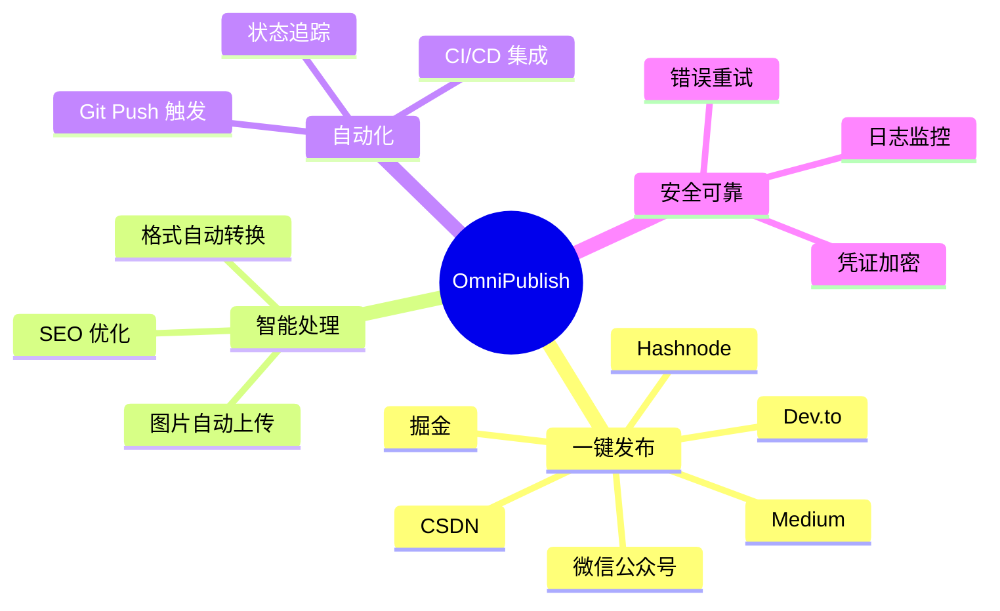
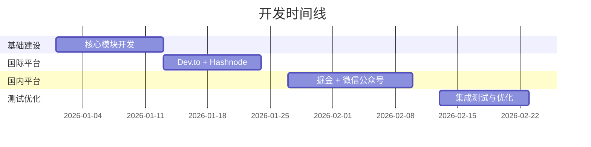

# OmniPublish 全平台发布系统 - 文档总览

> **项目代号**: OmniPublish  
> **核心理念**: Write Once, Publish Everywhere  
> **版本**: v1.0  
> **更新日期**: 2026-01-01

---

## 📚 文档导航

本项目包含完整的技术开发文档体系,按以下顺序阅读:

### 1️⃣ [快速开始](./00_快速开始.md) ⚡
**阅读时间**: 10 分钟  
**适合人群**: 所有用户

快速上手指南,包含:
- 5 分钟快速部署
- 第一篇文章发布
- 常见问题解答

**立即开始** → [00_快速开始.md](./00_快速开始.md)

---

### 2️⃣ [技术架构文档](./01_技术架构文档.md) 🏗️
**阅读时间**: 30 分钟  
**适合人群**: 开发者、架构师

系统设计和技术选型,包含:
- 系统概述与核心价值
- 模块化架构设计
- 核心模块详细设计
- 平台适配器架构
- 安全与风控策略
- 扩展性设计

**关键内容**:
- ✅ 完整的系统架构图
- ✅ 核心模块代码示例
- ✅ 数据流设计
- ✅ 防御性编程规范

---

### 3️⃣ [实施计划](./02_实施计划.md) 📋
**阅读时间**: 45 分钟  
**适合人群**: 项目经理、开发团队

详细的开发路线图,包含:
- 开发里程碑 (6-8 周)
- Sprint 详细规划 (5 个 Sprint)
- 技术选型确认
- 风险评估与应对
- 验证计划

**关键内容**:
- ✅ Gantt 图时间线
- ✅ 每个 Sprint 的任务清单
- ✅ 验收标准
- ✅ 风险矩阵

---

### 4️⃣ [API 集成规范](./03_API集成规范.md) 🔌
**阅读时间**: 60 分钟  
**适合人群**: 后端开发者

各平台 API 调用详解,包含:
- **国际平台**: Dev.to, Hashnode, Medium, Ghost
- **国内平台**: 掘金, 微信公众号, CSDN
- 通用规范 (请求头、超时、重试)
- 错误处理与速率限制

**关键内容**:
- ✅ 完整的 API 调用示例
- ✅ 认证机制详解
- ✅ 平台特定注意事项
- ✅ 错误码映射表

---

### 5️⃣ [部署运维文档](./04_部署运维文档.md) 🚀
**阅读时间**: 40 分钟  
**适合人群**: 运维工程师、DevOps

部署、监控和维护指南,包含:
- 环境准备
- 本地部署
- CI/CD 部署 (GitHub Actions)
- 配置管理
- 监控与日志
- 故障排查
- 维护指南

**关键内容**:
- ✅ 完整的 GitHub Actions 配置
- ✅ 日志系统设计
- ✅ 常见问题解决方案
- ✅ 定期维护清单

---

## 🎯 快速定位

### 我想...

| 需求 | 推荐文档 | 章节 |
|------|---------|------|
| **快速上手,发布第一篇文章** | [快速开始](./00_快速开始.md) | 5 分钟快速开始 |
| **了解系统架构** | [技术架构文档](./01_技术架构文档.md) | 系统架构 |
| **查看开发计划** | [实施计划](./02_实施计划.md) | Sprint 详细规划 |
| **集成 Dev.to API** | [API 集成规范](./03_API集成规范.md) | Dev.to API |
| **集成掘金 API** | [API 集成规范](./03_API集成规范.md) | 掘金 API |
| **配置 GitHub Actions** | [部署运维文档](./04_部署运维文档.md) | CI/CD 部署 |
| **解决图片上传问题** | [快速开始](./00_快速开始.md) | 常见问题 Q1 |
| **更新掘金 Cookie** | [部署运维文档](./04_部署运维文档.md) | Cookie 更新流程 |

---

## 📊 项目概览

### 核心特性



### 技术栈

| 类别 | 技术 |
|------|------|
| **语言** | Python 3.11+ |
| **核心库** | httpx, Playwright, python-frontmatter |
| **图床** | Cloudflare R2 / 阿里云 OSS |
| **CI/CD** | GitHub Actions |
| **日志** | loguru |

### 支持平台

| 平台 | 类型 | 状态 | 优先级 |
|------|------|------|--------|
| **Dev.to** | 国际 / API | ✅ 已实现 | P0 |
| **Hashnode** | 国际 / GraphQL | ✅ 已实现 | P0 |
| **Medium** | 国际 / API | ✅ 已实现 | P1 |
| **Ghost** | 国际 / API | 🚧 计划中 | P2 |
| **掘金** | 国内 / 私有 API | ✅ 已实现 | P0 |
| **微信公众号** | 国内 / 官方 API | ✅ 已实现 | P0 |
| **CSDN** | 国内 / 浏览器自动化 | 🚧 计划中 | P1 |
| **知乎** | 国内 / 浏览器自动化 | 📅 待定 | P2 |

---

## 🚀 开发进度

### 里程碑



### 当前状态

- ✅ **文档完成**: 100%
- 🚧 **代码实现**: 0% (待开始)
- 📅 **预计完成**: 2026-02-23

---

## 🤝 贡献指南

### 参与方式

1. **报告问题**: [GitHub Issues](https://github.com/yourname/omnipublish/issues)
2. **提交代码**: Fork → 开发 → Pull Request
3. **完善文档**: 修正错误、补充示例
4. **添加平台**: 实现新的平台适配器

### 开发流程

```bash
# 1. Fork 项目
# 2. 克隆到本地
git clone https://github.com/yourname/omnipublish.git

# 3. 创建功能分支
git checkout -b feature/new-platform-adapter

# 4. 开发并测试
pytest tests/

# 5. 提交代码
git commit -m "feat: 添加 XXX 平台适配器"

# 6. 推送并创建 PR
git push origin feature/new-platform-adapter
```

---

## 📞 获取帮助

### 联系方式

- **GitHub Issues**: [提交问题](https://github.com/yourname/omnipublish/issues)
- **讨论区**: [参与讨论](https://github.com/yourname/omnipublish/discussions)
- **Telegram**: [加入群组](https://t.me/omnipublish)
- **Email**: support@omnipublish.dev

### 常见问题

在提问前,请先查看:
1. [快速开始 - 常见问题](./00_快速开始.md#常见问题)
2. [部署运维 - 故障排查](./04_部署运维文档.md#故障排查)
3. [GitHub Issues](https://github.com/yourname/omnipublish/issues)

---

## 📄 许可证

本项目采用 **MIT License** 开源协议。

详见 [LICENSE](./LICENSE) 文件。

---

## 🎉 致谢

感谢以下项目和服务:

- [Dev.to](https://dev.to) - 开发者社区
- [Hashnode](https://hashnode.com) - 技术博客平台
- [Cloudflare R2](https://www.cloudflare.com/products/r2/) - 对象存储
- [Playwright](https://playwright.dev) - 浏览器自动化
- [GitHub Actions](https://github.com/features/actions) - CI/CD 平台

---

**开始你的自动化发布之旅! 🚀**

**推荐阅读顺序**: [快速开始](./00_快速开始.md) → [技术架构](./01_技术架构文档.md) → [实施计划](./02_实施计划.md)
